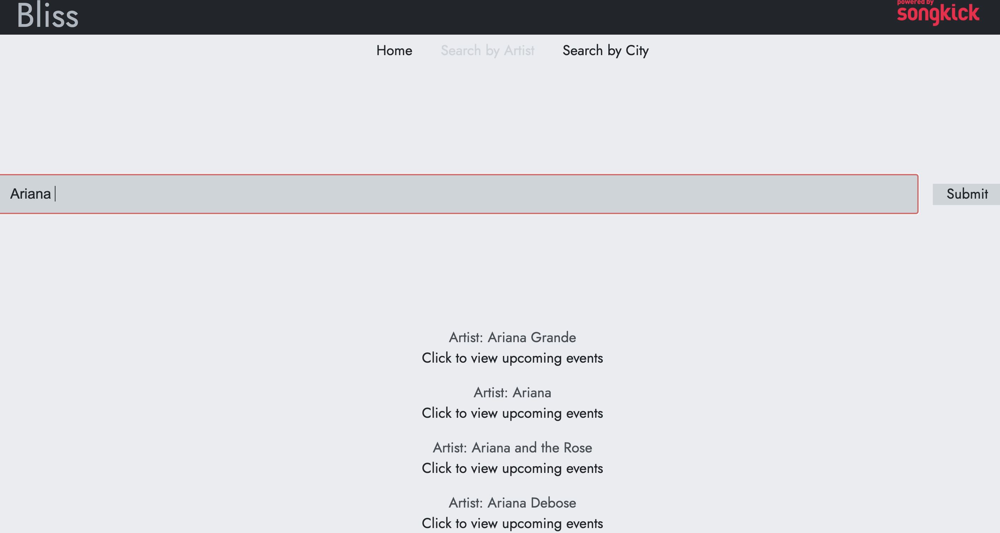
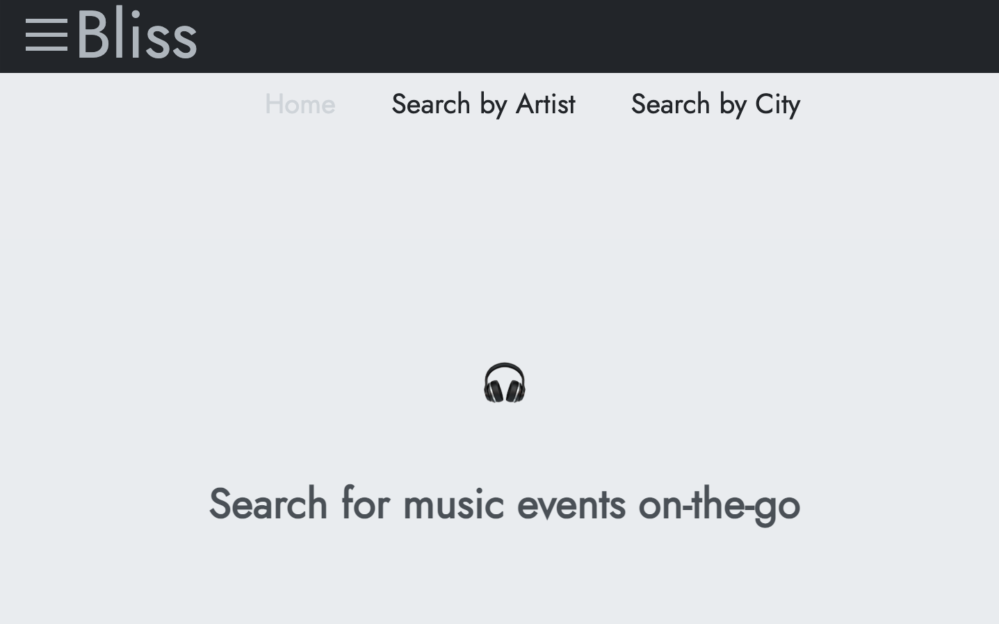

# Bliss: Music Event Search App

## Project Description

My app is titled "Bliss" -- it is a music event search application using ReactJS and utilizing Songkick's API database. This app is intended for users who are constantly 'on-the-go' and need to quickly search for virtual live events online and/or in the area; no login or sign-up required to access the app. Users can search by Artist Name and by City or nearest Metro Area.

## Desktop Preview and Mobile Device Preview

## Technologies and Frameworks Used
- ReactJS, React Player, HTML5/CSS, Javascript

## Installation Instructions
- No install needed. For optimal user experience, use a web browser, preferably Google Chrome and/or Firefox to access the site.

## Deployment
- Application deployed via [Heroku](https://www.heroku.com/). Deployment is synced to GitHub and configured to automatically deploy every time the code is pushed to the `master` branch.

## Contribution Instructions
> To get started...

- Fork this repository

- Clone this repository to your local machine 

- Create a new pull request and/or submit any new issues 
